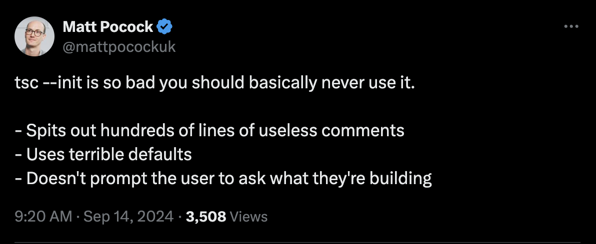

# ts-init

A CLI tool to initialize a tsconfig based on Matt Pocock's [tsconfig cheat sheet](https://www.totaltypescript.com/tsconfig-cheat-sheet).

made cause of this tweet [here](https://x.com/mattpocockuk/status/1834839649593794566)



### Install

```bash
npm install -g @bekacru/ts-init
```

### Usage

```bash
npx ts-init
```

### License

MIT